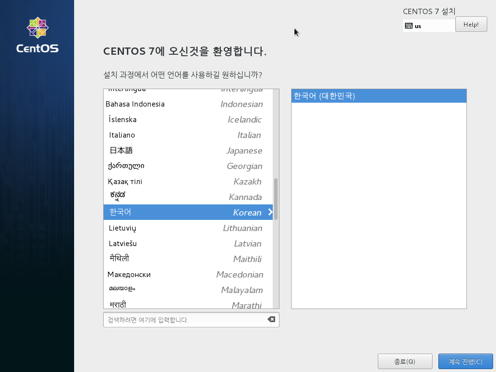
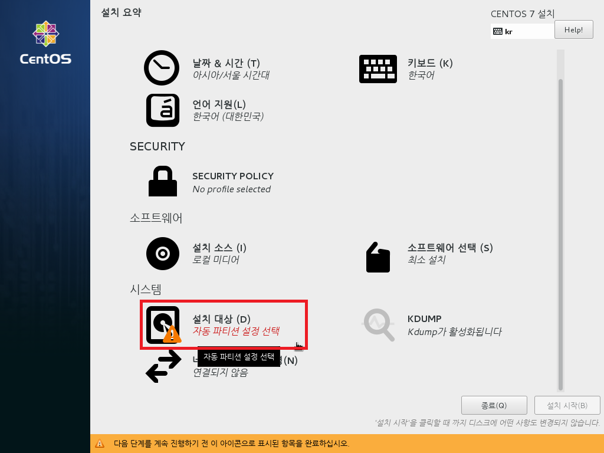

# CentOS 7 or RHEL 7 Minimal ISO를 이용한 설치

이 문서는 CentOS 7 또는 RHEL 7의 Minial ISO를 이용하셔 설치 하는 방법에 대하여 기술합니다.

안녕 리눅스의 설치는 기본적으로 안녕 리눅스용 kickstart 설치 환경을 이용합니다. kickstart 설치가 가능하신 분들이나 kickstart 설치를 원하시는 분들은 [RHEL 7 install Guide](https://access.redhat.com/documentation/ko-KR/Red_Hat_Enterprise_Linux/7/html/Installation_Guide/)의 [booting option](https://access.redhat.com/documentation/ko-KR/Red_Hat_Enterprise_Linux/7/html/Installation_Guide/chap-anaconda-boot-options.html) 을 참조하여 설치를 하시기 바랍니다. 안녕 리눅스용 kickstart는 다음 URL에서 받으실 수 있습니다.

> http://mirror.oops.org/pub/AnNyung/3/inst/AnNyung.ks
> http://ftp.kr.freebsd.org/pub/AnNyung/3/inst/AnNyung.ks

하지만, 요즘 환경에서 kickstart 설정 파일을 기존의 ISO에 포함시켜 만들거나 하는 작업이 그리 간편하지는 않고 또한 RHEL7에서 systemd를 도입함으로서 설치 환경의 자동화가 좀 더 번거로워 졌기 때문에, 여기서는 CentOS 7이나 RHEL 7을 설치한 이후에, 안녕 리눅스로 전환하는 방법을 이용합니다.

또한, 설치 후, 작업을 별도로 해야 하기 때문에 될 수 있으면, <u>Network Install ISO를 이용하여 설치하는 방법</u>을 권장 합니다.

이 문서는 Windows용 VirtualBox에서 설치를 하는 이미지를 보여줍니다. 이 이미지는 PC나 서버에 CDROM 또는 USB 설치시에 동일하게 적용이 됩니다.

또한, Minimal ISO를 이용하여 부팅 매체(CD 또는 USB)를 만드는 방법은 여기서 다루지 않으니, 인터넷에서 검색을 하여 준비를 하여야 합니다. Miniaml ISO의 버전은 7.x 대이면 어떤 버전이든 상관이 없습니다. 안녕 리눅스 전환시에 최신 버전으로 업데이트가 됩니다.

다음의 설명은 일반적인 CentOS 7이나 RHEL 7의 설치와 동일하며, 안녕 설치를 좀 더 깔끔하게 할 수 있는 옵션 선정을 제공 합니다.

## 1. CDROM 또는 USB 부팅

처음 부팅을 하고 Install가 실행이 되면 위와 같은 화면이 나오게 됩니다. 화살표 키 또는 탭키를 이용하여 <strong style="color: #777; text-decoration:underline;">Install CentOS 7</strong>을 선택 한 후에 엔터를 실행합니다.

## 2. 언어 선택

편안한 언어를 선택 하시면 됩니다.

## 3. 기본 설치 화면

언어 선택에서 한국어를 선택하였다면, 위의 이미지와 같이 되어 있을 겁니다. 만약 다른 언어를 선택하였다면, 시간 설정과 키보드, 언어지원등의 설정을 직접 원하시는 대로 해 주시면 됩니다.

안녕 리눅스 설치를 위해서는, 기본적으로 **_디스크 파티션_** 과 **_네트워크 설정_**, **_KDUMP_**만 비활성화 해 주시면 됩니다.

Security policy의 경우에는, 여기서 설정을 하더라도 안녕 리눅스 전환시에 SELINUX가 disabled로 설정이 됩니다. 그러므로 SELINUX를 사용하기를 원한다면, 여기서 선택을 하지말고 설치를 완료한 후에 SELINUX를 활성화 시키십시오.

## 3. 디스크 파티션

필자는 자동 파티셔닝과 LVM을 선호하지 않고, 또한 통파티션을 선호하기 때문에 아래의 디스크 파티션 이미지는 필자의 선호에 의한 화면을 보여 줍니다.

디스크 파티션의 경우 안녕 리눅스 설치에 큰 영향을 주지 않기 때문에 설치하시는 분들의 선호에 맞게 해 주시면 되겠습니다.

디스크 파티션닝에 대해서는 [RHEL 7 install Guide](https://access.redhat.com/documentation/ko-KR/Red_Hat_Enterprise_Linux/7/html/Installation_Guide/)의 [설치 대상](https://access.redhat.com/documentation/ko-KR/Red_Hat_Enterprise_Linux/7/html/Installation_Guide/chap-anaconda-boot-options.html) 문서를 참조 하시기 바랍니니다.

디스크 파티셔닝을 하기 위해서는 **3. 기본 설치 화면**의 붉은색 사각형으로 표시되어 있는 **설치 대상(D)** 를 클릭 합니다.

## 4. 네트워크 설정
