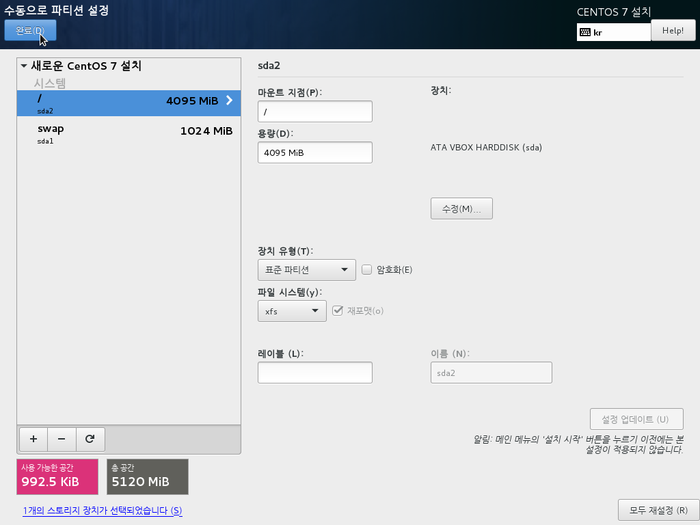
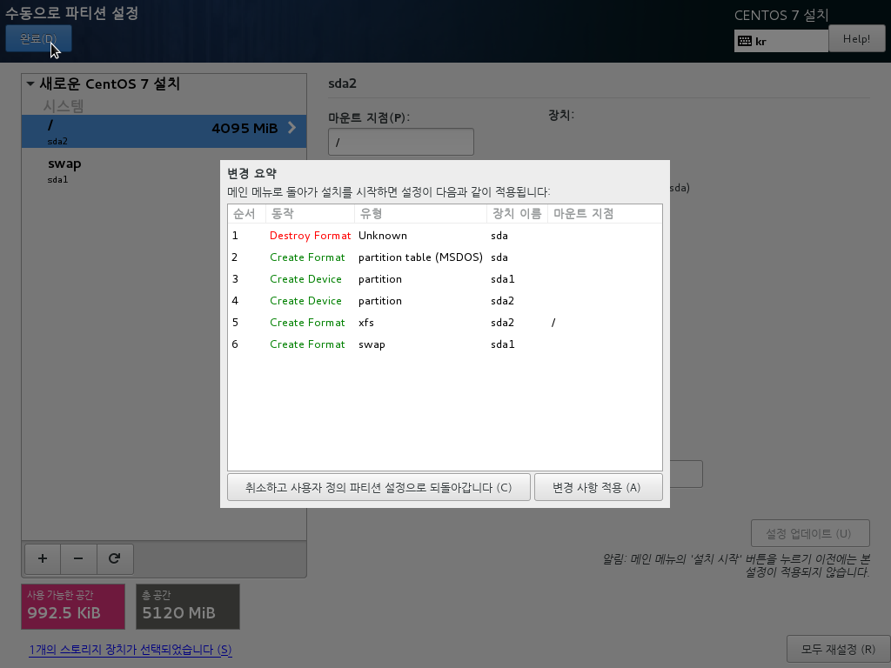
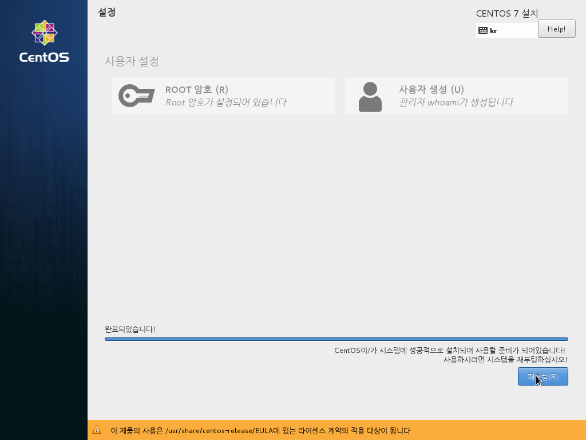

# CentOS 7 or RHEL 7 Minimal ISO를 이용한 설치

**Copyright 2016 &copy; JoungKyun.Kim all rights reserved.**

2016.02.29<br>
김정균 &lt; http://oops.org &gt;

이 문서는 CentOS 7 또는 RHEL 7의 Minial ISO를 이용하셔 설치 하는 방법에 대하여 기술합니다.

안녕 리눅스의 설치는 기본적으로 안녕 리눅스용 kickstart 설치 환경을 이용합니다. kickstart 설치가 가능하신 분들이나 kickstart 설치를 원하시는 분들은 [RHEL 7 install Guide](https://access.redhat.com/documentation/ko-KR/Red_Hat_Enterprise_Linux/7/html/Installation_Guide/)의 [booting option](https://access.redhat.com/documentation/ko-KR/Red_Hat_Enterprise_Linux/7/html/Installation_Guide/chap-anaconda-boot-options.html) 을 참조하여 설치를 하시기 바랍니다. 안녕 리눅스용 kickstart는 다음 URL에서 받으실 수 있습니다.

> http://mirror.oops.org/pub/AnNyung/3/inst/AnNyung.ks
> http://ftp.kr.freebsd.org/pub/AnNyung/3/inst/AnNyung.ks


하지만, 요즘 환경에서 kickstart 설정 파일을 기존의 ISO에 포함시켜 만들거나 하는 작업이 그리 간편하지는 않고 또한 RHEL7에서 systemd를 도입함으로서 설치 환경의 자동화가 좀 더 번거로워 졌기 때문에, 여기서는 CentOS 7이나 RHEL 7을 설치한 이후에, 안녕 리눅스로 전환하는 방법을 이용합니다.

또한, 설치 후, 작업을 별도로 해야 하기 때문에 될 수 있으면, <u>Network Install ISO를 이용하여 설치하는 방법</u>을 권장 합니다.

이 문서는 Windows용 VirtualBox에서 설치를 하는 이미지를 보여줍니다. 이 이미지는 PC나 서버에 CDROM 또는 USB 설치시에 동일하게 적용이 됩니다.

또한, Minimal ISO를 이용하여 부팅 매체(CD 또는 USB)를 만드는 방법은 여기서 다루지 않으니, 인터넷에서 검색을 하여 준비를 하여야 합니다. Miniaml ISO의 버전은 7.x 대이면 어떤 버전이든 상관이 없습니다. 안녕 리눅스 전환시에 최신 버전으로 업데이트가 됩니다.

다음의 설명은 일반적인 CentOS 7이나 RHEL 7의 설치와 동일하며, 안녕 설치를 좀 더 깔끔하게 할 수 있는 옵션 선정을 제공 합니다.


## 1. CDROM 또는 USB 부팅


처음 부팅을 하고 Install가 실행이 되면 위와 같은 화면이 나오게 됩니다. 화살표 키 또는 탭키를 이용하여 <strong style="color: #777; text-decoration:underline;">Install CentOS 7</strong>을 선택 한 후에 엔터를 실행합니다.

## 2. 언어 선택


편안한 언어를 선택 하시면 됩니다.

## 3. 기본 설치 화면


언어 선택에서 한국어를 선택하였다면, 위의 이미지와 같이 되어 있을 겁니다. 만약 다른 언어를 선택하였다면, 시간 설정과 키보드, 언어지원등의 설정을 직접 원하시는 대로 해 주시면 됩니다.

안녕 리눅스 설치를 위해서는, 기본적으로 **_디스크 파티션_** 과 **_네트워크 설정_**, **_KDUMP_**만 비활성화 해 주시면 됩니다.

Security policy의 경우에는, 여기서 설정을 하더라도 안녕 리눅스 전환시에 SELINUX가 disabled로 설정이 됩니다. 그러므로 SELINUX를 사용하기를 원한다면, 여기서 선택을 하지말고 설치를 완료한 후에 SELINUX를 활성화 시키십시오.

## 4. 디스크 파티션

필자는 자동 파티셔닝과 LVM을 선호하지 않고, 또한 통파티션을 선호하기 때문에 아래의 디스크 파티션 이미지는 필자의 선호에 의한 화면을 보여 줍니다.

디스크 파티션의 경우 안녕 리눅스 설치에 큰 영향을 주지 않기 때문에 설치하시는 분들의 선호에 맞게 해 주시면 되겠습니다.

디스크 파티션닝에 대해서는 [RHEL 7 install Guide](https://access.redhat.com/documentation/ko-KR/Red_Hat_Enterprise_Linux/7/html/Installation_Guide/)의 [설치 대상](https://access.redhat.com/documentation/ko-KR/Red_Hat_Enterprise_Linux/7/html/Installation_Guide/chap-anaconda-boot-options.html) 문서를 참조 하시기 바랍니니다.

디스크 파티셔닝을 하기 위해서는 **3. 기본 설치 화면**의 붉은색 사각형으로 표시되어 있는 **설치 대상(D)** 를 클릭 합니다.






파티셔닝이 완료가 되면 위의 이미지처럼 **설치 대상(D)** 아래에 설정 사항이 나오게 됩니다.

다음 네트워크 설정을 위해서는 이미지의 붉은색 사각형 표시 부분을 클릭 합니다.

<strong style="color: red;">주의</strong>: disk가 여러개일 경우에는 booting partion 설정에 주의하십시오.


## 5. 네트워크 설정

네트워크 설정에 대해서는 [RHEL 7 install Guide](https://access.redhat.com/documentation/ko-KR/Red_Hat_Enterprise_Linux/7/html/Installation_Guide/)의 [네트워크 및 호스트명(N)](https://access.redhat.com/documentation/ko-KR/Red_Hat_Enterprise_Linux/7/html/Installation_Guide/chap-anaconda-boot-options.html) 문서를 참조 하시기 바랍니니다.

여기서는 static IP를 설정하는 이미지를 보여 드립니다. 네트워크 설정은 각각의 환경에 맞게 설정을 해 주시면 됩니다.


네트워크 설정을 완료하면 위의 화면 처럼 설정된 내용이 나오게 됩니다.

RHEL7 부터는 ethernet device이름이 eth에서 다른 이름으로 변경이 되었습니다. 하지만 안녕 리눅스에서는 설치 완료 후에 eth로 다시 변경이 되게 됩니다.

네트워크 설정을 완료 하였다면 **네트워크 및 호스트명(N)** 옆의 붉은색 사각형으로 표시된 **KDUMP**를 클릭 합니다.


## 6. KDUMP 비활성화


비활성화 하도록 합니다.


## 7. 설치 시작


여기까지 진행이 되었다면, 위의 이미지와 같이 우측 하단의 <strong style="color: red;">설치 시작(B)</strong> 버튼이 푸른색으로 활성화가 됩니다. 이 <strong style="color: red;">설치 시작(B)</strong> 버튼을 클릭하면 아래의 이미지와 같이 설치가 시작이 됩니다.


참고로, RHEL 7부터는 installer에도 systemd가 도입이 되었기 때문에 설치를 하는 중에 root 암호 설정과 계정 유저 생성을 동시에 진행을 하게 되므로, Root 암호 설정과 계정 사용자를 추가해 주십시오.

주의할 것은, 안녕 리눅스 전환 후에 원격으로 ROOT shell login이 기본으로 차단이 되게 됩니다. 그러므로 일반 유저를 꼭 등록을 하여야 하며, 아래 이미지와 같이 root 계정으로 sudo 나 su를 할 수 있는 환경을 만들어 주십시오.


<strong style="color:red;">참고!!</strong> 주의할 것은, 생성한 일반 유저는 최초 접속시에 무조건 암호를 변경 되도록 되어 있습니다. 이는 ISMS 보안 심사를 위한 설정에 의하여 적용된 사항이므로, 다른 배포본과의 차이 입니다.


## 8. 설치 완료 및 재부팅



좌측 하단의 <strong style="color: red;">재부팅(R)</strong> 버튼이 푸른색으로 활성화가 되면, 클릭하여 리부팅을 합니다.


설치시에 지정한 암호로 로그인을 합니다.

## 9. 안녕 리눅스 전환

드디어 안녕 리눅스 설치를 시작 합니다.


로그인을 한 후, 위의 이미지처럼 안녕 리눅스 bootstrap 파일을 다운로드 받아서 실행을 합니다. 안녕 리눅스의 bootstrap 파일은 다음의 URL에서 받을 수 있습니다.

> http://mirror.oops.org/pub/AnNyung/3/inst/bootstrap<br>
> http://ftp.kr.freebsd.org/pub/AnNyung/3/inst/bootstrap

이 bootstarp을 실행하기 위해서는 perl이 필요 합니다. 그러므로 실행 전에 perl을 yum을 이용하여 설치를 해 줘야 합니다.

```bash
[root@localhost /root] yum install perl
[root@localhost /root] curl -o bootstrap http://mirror.oops.org/pub/AnNyung/3/inst/bootstrap
[root@localhost /root] bash bootstrap
```


안녕 리눅스 bootstrap을 실행하면 다음과 같은 작업을 하게 됩니다.

1. annyung-release package를 설치합니다.
  1. 시스템 banner를 **AnNyung LInux**로 변경 합니다.
  2. 콘솔 해상도를 **1024x768**로 변경 합니다.
  3. 부팅 화면의 커널 리스트의 CentOS를 AnNyung으로 변경 합니다. (RHEL 7에서 전환할 경우에는 변경되지 않습니다. 이는 시스템상의 문제라기 보다는 CentOS라는 문자열을 AnNyung으로 변경하는 것이기 때문입니다.)
  4. **ethernet device** 이름을 **eth**로 복원 합니다.
  5. /etc/fstab 에서 hdd에 **noatime** 옵션을 추가 합니다.
  6. root account를 wheel group에 추가 합니다.
  7. **AnNyung LInux repository**가 설치 됩니다.
  8. **EPEL repository**가 설치 됩니다.
2. LANG 환경 변수를 **ko_KR.UTF-8** 로 설정 합니다.
3. 시스템에 설치된 32bit package를 제거 합니다.
4. 시스템에 설치된 패키지들을 최신 상태로 업데이트 합니다.
5. zero configuration 설정을 제거 합니다. (wifi 환경에서는 자동 설정이 되지 않습니다.)
6. IPv6 설정을 제거 합니다. IPv6 환경을 사용하신다면, bootstrap 파일에서 no_ipv6_off 라인을 주석 처리 하십시오.
7. **selinux** 설정을 disable 합니다.
8. SMTP 데몬을 부팅시에 시작하지 않도록 합니다.
9. 기본 패키징 중에서 안녕 리눅스 패키지와 충돌이 발생하는 패키지들의 업데이트를 block 시킵니다.
10. **yum-cron** 설정을 활성화 합니다. (1일 1회 업데이트 체크 및 업데이트)
11. 기타 필요한 기본 패키지들을 설치합니다.
12. 기본 방화벽인 firewalld 를 제거하고 oops-firewall을 설치 합니다.
  1. firewalld보다 훨씬 직관적입니다.
  2. http://oops.org/?t=lecture&sb=firewall&n=2 문서 참조
  3. 기본으로 22번 port만 anywhere로 열려 있습니다.

bootstrap 실행이 완료되면 다시 rebooting을 하도록 합니다.

## 10. 안녕 리눅스 부팅


grub2의 booting kernel list 입니다. banner가 **AnNyung LInux**로 변경이 되었습니다. RHEL installer로 진행을 했을 경우에는 AnNyung LInux라고 나오지 않을 수도 있습니다. 그러니 문제가 있다고 생각할 필요는 없습니다.


**/etc/issue**의 banner가 **AnNyung LInux**로 변경이 되었으며, 콘솔 해상도가 1024*768로 변경이 되었습니다.


ethernet 이름이 다시 **eth**로 변경이 되었으며, 최초 설치 사이즈는 1.3Gbyte 입니다.


부팅시에 실행되는 daemon list 입니다. RHEL 6까지는 **ntsysv** 명령이나 **chkconfig** 명령으로 확인이 가능했지만, RHEL 7부터 systemd 도입으로 다음의 명령을 이용하면 가능 합니다.

```bahs
[root@localhost /root] systemctl list-units --type=service
[root@localhost /root] systemctl disable postfix  // postfix를 부팅시에 실행 안하도록
[root@localhost /root] systemctl enable postfix   // postfix를 부팅시에 실행 하도록
```


firewalld 대신에 설치된 oops-firewall 이 실행된 환경이며, 기본으로 inbound는 22번 port만 open이 되어 있습니다. 그리고, 안녕 3에 설치된 oops-firewall 7.x는 outbound ACL 제어가 더욱 확실해 졌기 때문에 outbound 설정도 잘 고려해야 합니다. outbound는 기본으로 tcp 21(ftp), 22(ssh), 25(smtp), 43(ntp), 80(http), 443(https), 873(rsync) 그리고 udp 53(dnslookup), 123(snmp)이 열려 있습니다.

## 11. 안녕 리눅스 운영상 참고 사항

안녕 리눅스 3은 ISMS 인증 심사 관련 설정이 deploy 되어 있기 때문에 이 설정으로 인한 운영상의 문제가 발생할 수 있습니다. 그러니 다음의 문서를 꼭 참고하여 운영상의 이슈에 대하여 대비 하시기 바랍니다.

1. [안녕 리눅스 3 Account 기본 설정](https://joungkyun.gitbooks.io/annyung-3-user-guide/content/chapter3-2-pam-control.html)
2. [안녕 리눅스 3 Firewall 설정](https://joungkyun.gitbooks.io/annyung-3-user-guide/content/chapter2-2-firewall.html)