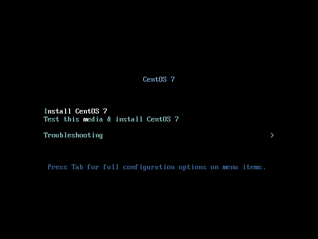

# CentOS 7 or RHEL 7 Minimal ISO를 이용한 설치

이 문서는 CentOS 7 또는 RHEL 7의 Minial ISO를 이용하셔 설치 하는 방법에 대하여 기술합니다.

안녕 리눅스의 설치는 기본적으로 안녕 리눅스용 kickstart 설치 환경을 이용한다. 하지만, 요즘 환경에서 kickstart 설정 파일을 기존의 ISO에 포함시켜 만들거나 하는 작업이 그리 간편하지는 않기 때문에, 여기서는 CentOS 7이나 RHEL 7을 설치한 이후에, 안녕 리눅스로 전환하는 방법을 이용합니다.

설치 후, 작업을 별도로 해야 하기 때문에 될 수 있으면, Network Install ISO를 이용하여 설치한느 것을 권장 합니다.

이 문서는 PC나 VirtualBox에서 설치를 할때 동일하게 적용할 수 있습니다. (Xen server는 별도의 방법으로 설치를 해야 합니다.)

또한, Minimal ISO를 이용하여 부팅 매체(CD 또는 USB)를 만드는 방법은 여기서 다루지 않으니, 인터넷에서 검색을 하여 준비를 하여야 합니다.

## 1. CDROM 또는 USB 부팅

처음 부팅을 하고 Install가 실행이 되면 위와 같은 화면이 나오게 됩니다. 화살표 키 또는 탭키를 이용하여 <strong style="color: #777; text-decoration:underline;">Install CentOS 7</strong>을 선택 한 후에 엔터를 실행합니다.

## 2. 언어 선택