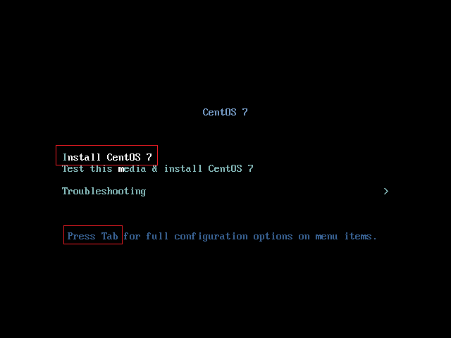
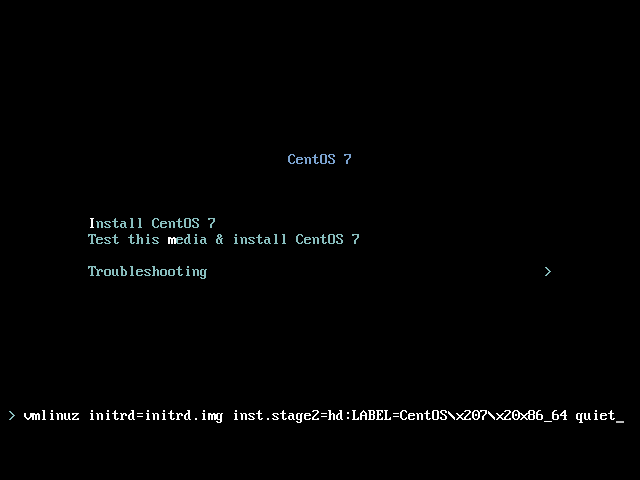
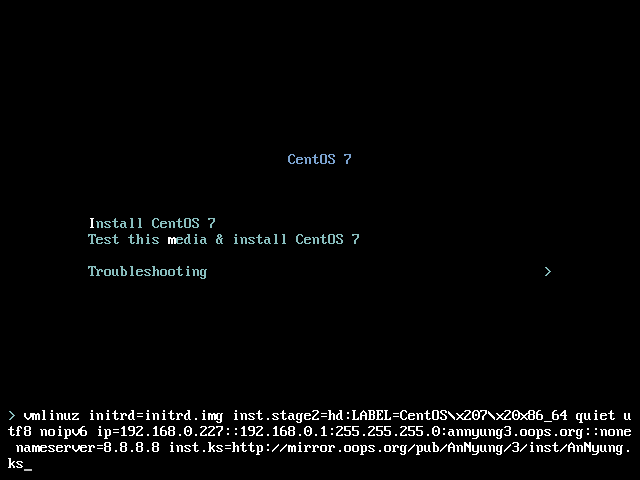

# CentOS 7 또는 RHEL 7 Network Install ISO를 이용한 설치

**Copyright 2016 &copy; JoungKyun.Kim all rights reserved.**

2016.01.30 
김정균 &lt; http://oops.org &gt;

Not Yet!

이 문서는 CentOS 7 또는 RHEL 7의 Netinstall ISO를 이용하셔 설치 하는 방법에 대하여 기술합니다.

이 문서는 Windows용 VirtualBox에서 CentOS 7의 Netinsatll ISO image를 이용하여 설치를 하는 이미지를 보여줍니다. 이 이미지는 PC나 서버에 CDROM 또는 USB 설치시에 동일하게 적용이 됩니다.

또한, Netinstall ISO를 이용하여 부팅 매체(CD 또는 USB)를 만드는 방법은 여기서 다루지 않으니, 인터넷에서 검색을 하여 준비를 하여야 합니다. Netinstall ISO의 버전은 7.x 대이면 어떤 버전이든 상관이 없습니다. 안녕 리눅스 전환시에 최신 버전으로 업데이트가 됩니다.

다음의 설명은 일반적인 CentOS 7이나 RHEL 7의 설치와 동일하며, 안녕 설치를 좀 더 깔끔하게 할 수 있는 옵션 선정을 제공 합니다.

## 1. CDROM 또는 USB 부팅

준비한 Netinstall ISO를 이용하여 만든 booting 매채(CDROM or USB)를 이용하여 booting 을 합니다.

Installer 가 구동이 되면 제일 처음은 위와 같은 화면이 나오게 됩니다.

화살표 키를 이용하여 이미지 상의 붉은 색 상자로 표시되어 있는 "**Install CentOS 7**" 을 선택을 선택한 후에, "**Tab**" 키를 누릅니다. 그러면 아래의 이미지와 같이 하단에 booting option을 입력할 수 있게 됩니다. 만약 UEFI 기반의 시스템일 경우에는 "**e**"키를 눌러서 booting option을 입력할 수 있습니다.

이 부분이 잘 이해가 되지 않는다면 [RHEL 7 설치 가이드](https://access.redhat.com/documentation/ko-KR/Red_Hat_Enterprise_Linux/7/html/Installation_Guide/)의 [부트메뉴](https://access.redhat.com/documentation/ko-KR/Red_Hat_Enterprise_Linux/7/html/Installation_Guide/sect-boot-menu-x86.html) 섹션을 참고 하십시오.

여기에 아래와 같이 안녕 리눅스 설치를 위한 옵션을 추가해 줍니다.

RHEL 7에서 systemd를 도입하면서, installer인 Anaconda에도 systemd가 도입이 되면서 네트워크 인스톨 시에 IP를 입력하던 UI가 사라지고 이처럼 command line에서 IP를 지정을 해 줘야 하는 불편함이 생겼습니다. 여기서 IP를 지정하지 않아도 installer상에서 설정이 가능하지만, 그렇데 된다면 kickstart를 network으로 받아오지 못하는 관계로 command line option으로 IP를 지정해 줘야 합니다.

> utf8 noipv6 ip=192.168.0.227::192.168.0.1:255.255.255.0:annyung3.oops.org::none nameserver=8.8.8.8 inst.ks=http://mirror.oops.org/pub/AnNyung/3/inst/AnNyung.ks

command option으로 위와 같이 옵션을 추가해 주도록 합니다. ip는 여러분의 상황에 맞게 수정을 해야 합니다. 각 옵션에 대한 설명은 다음과 같습니다.

* **utf8** 
  따로 지정하지 않아도 상관이 없습니다. 기본값 입니다.
* **noipv6** 
  설치 프로그램에서 IPv6 지원을 비활성화하는데 사용됩니다. IPv6는 커널에 탑재되어 드라이버는 블랙리스트에 실리지 않습니다. 하지만 ipv6.disable dracut 옵션을 사용하여 IPv6를 비활성화할 수 있습니다.
  안녕리눅스 설치시에는 installer post script에서 기본으로 ipv6를 off 시키고 있으니, 여기서의 지정 유무는 영향을 주지 않습니다.
* **ip**
 * 설치하는 네트워크에 DHCP서버가 있을 경우 
   이 경우가 가장 best choise인 환경입니다. 그냥 "**_ip=dhcp_**" 로 지정하면 됩니다.
 * DHCP가 없어 수동으로 해야 하는 경우 
   "**_IPv4_ADDR::GATEWAY:SUBNET_MASK:HOSTNAME:INTERFACE:MTU_**의 형식으로 지정합니다.
   * **IPv4_ADDR** - 32bit로 된 IPv4 주소(예를 들면 10.1.1.2)를 사용합니다. <u>IP주소와 Gateway의 구분자는 "**::**" 임을 주의해야 합니다. 나머지 구분자는 "**:**" 입니다.</u>
   * **_GATEWAY_** - 해당 네트워크의 GATEWAY 주소를 지정합니다.
   * **_SUBNET_MASK_** - 해당 네트워크의 subnet mask를 지정합니다.
   * **_HOSTNAME_** - 설치할 서버의 hostname을 지정합니다.
   * **_INTERFACE_** - 설치할 서버의 network interface를 지정합니다. 대부분은 비워 놓아도 상관이 없습니다만, 간혹 여려개의 network insterface를 가진 서버에서 installer와 설치된 OS간의 ineterface 이름이 다른 경우에는 지정해 주는 것이 좋습니다. 이에 대해서는 [RHEL 7 설치 가이드](https://access.redhat.com/documentation/ko-KR/Red_Hat_Enterprise_Linux/7/html/Installation_Guide/)의 [부트옵션](https://access.redhat.com/documentation/ko-KR/Red_Hat_Enterprise_Linux/7/html/Installation_Guide/chap-anaconda-boot-options.html) 섹션을 참고 하십시오.
   * **_MTU_** - 대부분은 none으로 지정하시면 됩니다. 기본값은 1500 입니다.
 * IPv6 네트워크인 경우 
   안녕 리눅스는 IPv6 테스트 환경이 없어 이에 대한 지원을 하지 않습니다. 이는 안녕 리눅스가 IPv6를 사용하는데 문제가 있다는 의미가 아니며, IPv6에 대해서 특별히 수정한 것이 없기 때문에 RHEL 7 또는 CentOS 7의 지원항목을 이용하시면 된다는 의미입니다.
* **nameserver** 
  domain name resoving을 위한 네임 서버를 지정합니다. 딱히 이유가 없다면 google public dns인 8.8.8.8을 지정하면 됩니다.
* **inst.ks** 
  안녕 리눅스의 설치 정보가 들어 있는 kickstart file을 지정합니다. 만약 mirror.oops.org가 장애가 있을 경우에는 http://ftp.kr.freebsd.org/pub/AnNyung/3/inst/AnNyung.ks 를 이용할 수 있습니다.

 부팅 옵션에 대한 자세한 설명은 [RHEL 7 설치 가이드](https://access.redhat.com/documentation/ko-KR/Red_Hat_Enterprise_Linux/7/html/Installation_Guide/)의 [부트옵션](https://access.redhat.com/documentation/ko-KR/Red_Hat_Enterprise_Linux/7/html/Installation_Guide/chap-anaconda-boot-options.html) 섹션을 참고 하십시오.