# CentOS 7 또는 RHEL 7 Network Install ISO를 이용한 설치

**Copyright 2016 &copy; JoungKyun.Kim all rights reserved.**

2016.01.30<br>
김정균 &lt; http://oops.org &gt;

이 문서는 CentOS 7 또는 RHEL 7의 Netinstall ISO를 이용하셔 설치 하는 방법에 대하여 기술합니다.

이 문서는 Windows용 VirtualBox에서 CentOS 7의 Netinsatll ISO image를 이용하여 설치를 하는 이미지를 보여줍니다. 이 이미지는 PC나 서버에 CDROM 또는 USB 설치시에 동일하게 적용이 됩니다.

또한, Netinstall ISO를 이용하여 부팅 매체(CD 또는 USB)를 만드는 방법은 여기서 다루지 않으니, 인터넷에서 검색을 하여 준비를 하여야 합니다. Netinstall ISO의 버전은 7.x 대이면 어떤 버전이든 상관이 없습니다. 안녕 리눅스 전환시에 최신 버전으로 업데이트가 됩니다.

다음의 설명은 일반적인 CentOS 7이나 RHEL 7의 설치와 동일하며, 안녕 설치를 좀 더 깔끔하게 할 수 있는 옵션 선정을 제공 합니다.

Netinstall을 이용하여 설치할 경우에는 안녕 리눅스 kickstart를 호출하여 설치를 하기 때문에 dist partitioning과 root 암호 설정 및 user account 추가 3가지만 설정을 해 주면 됩니다.


## 1. CDROM 또는 USB 부팅

준비한 Netinstall ISO를 이용하여 만든 booting 매채(CDROM or USB)를 이용하여 booting 을 합니다.


Installer 가 구동이 되면 제일 처음은 위와 같은 화면이 나오게 됩니다.

화살표 키를 이용하여 이미지 상의 붉은 색 상자로 표시되어 있는 "**Install CentOS 7**" 을 선택을 선택한 후에, "**Tab**" 키를 누릅니다. 그러면 아래의 이미지와 같이 하단에 booting option을 입력할 수 있게 됩니다. 만약 UEFI 기반의 시스템일 경우에는 "**e**"키를 눌러서 booting option을 입력할 수 있습니다.

이 부분이 잘 이해가 되지 않는다면 [RHEL 7 설치 가이드](https://access.redhat.com/documentation/ko-KR/Red_Hat_Enterprise_Linux/7/html/Installation_Guide/)의 [부트메뉴](https://access.redhat.com/documentation/ko-KR/Red_Hat_Enterprise_Linux/7/html/Installation_Guide/sect-boot-menu-x86.html) 섹션을 참고 하십시오.


여기에 아래와 같이 안녕 리눅스 설치를 위한 옵션을 추가해 줍니다.


RHEL 7에서 systemd를 도입하면서, installer인 Anaconda에도 systemd가 도입이 되면서 네트워크 인스톨 시에 IP를 입력하던 UI가 사라지고 이처럼 command line에서 IP를 지정을 해 줘야 하는 불편함이 생겼습니다. 여기서 IP를 지정하지 않아도 installer상에서 설정이 가능하지만, 그렇데 된다면 kickstart를 network으로 받아오지 못하는 관계로 command line option으로 IP를 지정해 줘야 합니다.

    ip=192.168.0.227::192.168.0.1:255.255.255.0:annyung3.oops.org::none nameserver=8.8.8.8 inst.ks=http://mirror.oops.org/pub/AnNyung/3/inst/AnNyung.ks

command option으로 위와 같이 옵션을 추가해 주도록 합니다. ip는 여러분의 상황에 맞게 수정을 해야 합니다. 각 옵션에 대한 설명은 다음과 같습니다.

* **utf8**<br>
  따로 지정하지 않아도 상관이 없습니다. deprecated 똔느 remove 된 옵션으로 이미지상에 나와 있어 설명을 추가 합니다. 그냥 지정하지 않으면 됩니다.

* **noipv6**<br>
  설치 프로그램에서 IPv6 지원을 비활성화하는데 사용됩니다. IPv6는 커널에 탑재되어 드라이버는 블랙리스트에 실리지 않습니다. 하지만 ipv6.disable dracut 옵션을 사용하여 IPv6를 비활성화할 수 있습니다.
  안녕리눅스 설치시에는 installer post script에서 기본으로 ipv6를 off 시키고 있으니, 여기서의 지정 유무는 영향을 주지 않습니다. 역시 지정하지 않아도 무방합니다.

* **ip**
 * 설치하는 네트워크에 DHCP서버가 있을 경우<br>
   이 경우가 가장 best choise인 환경입니다. 그냥 "**_ip=dhcp_**" 로 지정하면 됩니다.

 * DHCP가 없어 수동으로 해야 하는 경우<br>
   "**_IPv4_ADDR::GATEWAY:SUBNET_MASK:HOSTNAME:INTERFACE:MTU_**의 형식으로 지정합니다.

   * **IPv4_ADDR** - 32bit로 된 IPv4 주소(예를 들면 10.1.1.2)를 사용합니다. <u>IP주소와 Gateway의 구분자는 "**::**" 임을 주의해야 합니다. 나머지 구분자는 "**:**" 입니다.</u>

   * **_GATEWAY_** - 해당 네트워크의 GATEWAY 주소를 지정합니다.

   * **_SUBNET_MASK_** - 해당 네트워크의 subnet mask를 지정합니다.

   * **_HOSTNAME_** - 설치할 서버의 hostname을 지정합니다.

   * **_INTERFACE_** - 설치할 서버의 network interface를 지정합니다. 대부분은 비워 놓아도 상관이 없습니다만, 간혹 여려개의 network insterface를 가진 서버에서 installer와 설치된 OS간의 ineterface 이름이 다른 경우에는 지정해 주는 것이 좋습니다. 이에 대해서는 [RHEL 7 설치 가이드](https://access.redhat.com/documentation/ko-KR/Red_Hat_Enterprise_Linux/7/html/Installation_Guide/)의 [부트옵션](https://access.redhat.com/documentation/ko-KR/Red_Hat_Enterprise_Linux/7/html/Installation_Guide/chap-anaconda-boot-options.html) 섹션을 참고 하십시오.
   * **_MTU_** - 대부분은 none으로 지정하시면 됩니다. 기본값은 1500 입니다.

 * IPv6 네트워크인 경우<br>
   안녕 리눅스는 IPv6 테스트 환경이 없어 이에 대한 지원을 하지 않습니다. 이는 안녕 리눅스가 IPv6를 사용하는데 문제가 있다는 의미가 아니며, IPv6에 대해서 특별히 수정한 것이 없기 때문에 RHEL 7 또는 CentOS 7의 지원항목을 이용하시면 된다는 의미입니다.

* **nameserver**<br>
  domain name resoving을 위한 네임 서버를 지정합니다. 딱히 이유가 없다면 google public dns인 8.8.8.8을 지정하면 됩니다.

* **inst.ks**<br>
  안녕 리눅스의 설치 정보가 들어 있는 kickstart file을 지정합니다. 만약 mirror.oops.org가 장애가 있을 경우에는 http://ftp.kr.freebsd.org/pub/AnNyung/3/inst/AnNyung.ks 를 이용할 수 있습니다.

부팅 옵션에 대한 자세한 설명은 [RHEL 7 설치 가이드](https://access.redhat.com/documentation/ko-KR/Red_Hat_Enterprise_Linux/7/html/Installation_Guide/)의 [부트옵션](https://access.redhat.com/documentation/ko-KR/Red_Hat_Enterprise_Linux/7/html/Installation_Guide/chap-anaconda-boot-options.html) 섹션을 참고 하십시오.
 
부팅 옵션을 입력한 후, 엔터를 누르면 설치 화면으로 넘어가게 됩니다.
 
 
 ## 2. 기본 설치 화면
 
 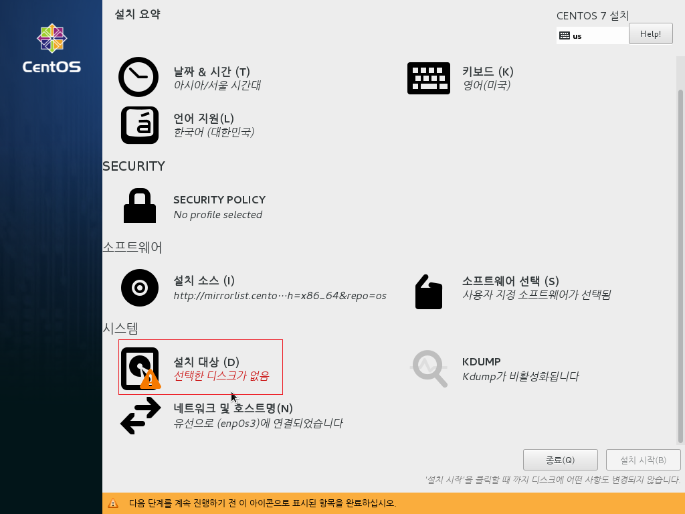
 
 안녕 리눅스의 kickstart 설정으로 위의 이미지의 붉은 박스 안에 표시된 "**_설치 대상(D)_**" 의 disk partioning만 해 주시면 됩니다.
 
 "**_네트워크 및 호스트명(N)_**"에 표기된 ethernet deivce 이름이 "**enp0s3**"과 같이 표기 되어 있더라도 안녕 리눅스는 설치 후 ehternet device이름을 이전 버전에서 처럼 "**eth**"로 사용하도록 변경을 하오니 참고 하시기 바랍니다.
 
 
## 3. 디스크 파티션

필자는 자동 파티셔닝과 LVM을 선호하지 않고, 또한 통파티션을 선호하기 때문에 아래의 디스크 파티션 이미지는 필자의 선호에 의한 화면을 보여 줍니다.

디스크 파티션의 경우 안녕 리눅스 설치에 큰 영향을 주지 않기 때문에 설치하시는 분들의 선호에 맞게 해 주시면 되겠습니다.

디스크 파티션닝에 대해서는 [RHEL 7 install Guide](https://access.redhat.com/documentation/ko-KR/Red_Hat_Enterprise_Linux/7/html/Installation_Guide/)의 [설치 대상](https://access.redhat.com/documentation/ko-KR/Red_Hat_Enterprise_Linux/7/html/Installation_Guide/chap-anaconda-boot-options.html) 문서를 참조 하시기 바랍니니다.

디스크 파티셔닝을 하기 위해서는 **2. 기본 설치 화면**의 붉은색 사각형으로 표시되어 있는 **설치 대상(D)** 를 클릭 합니다.

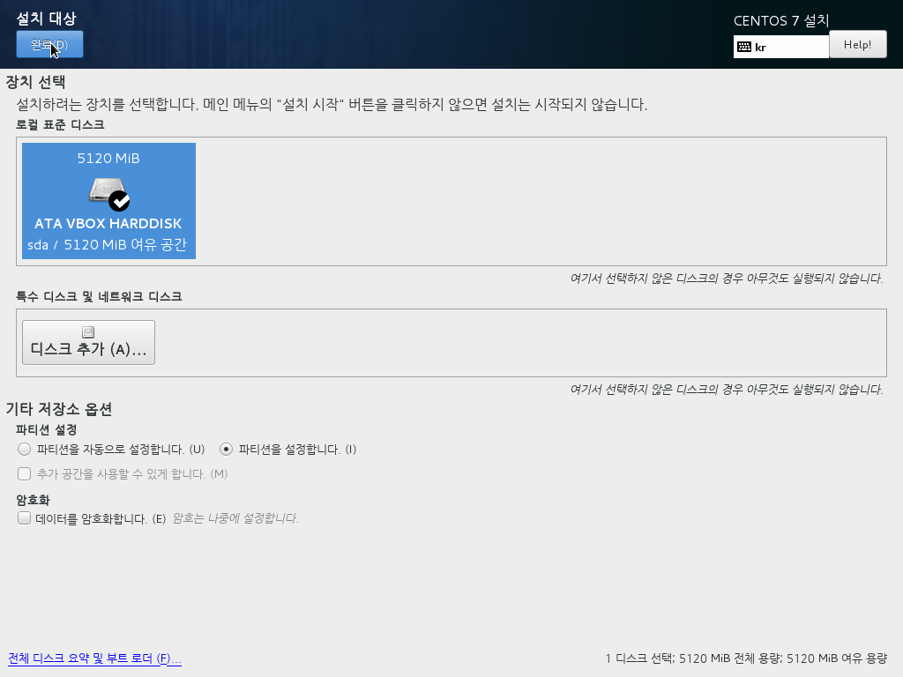
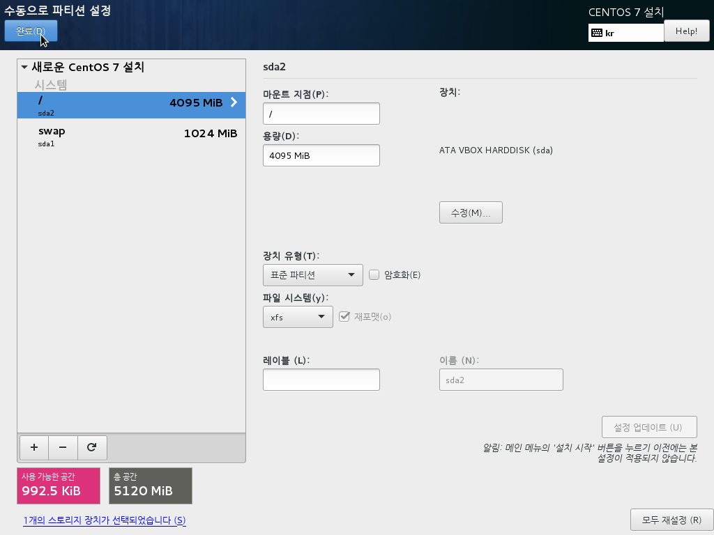
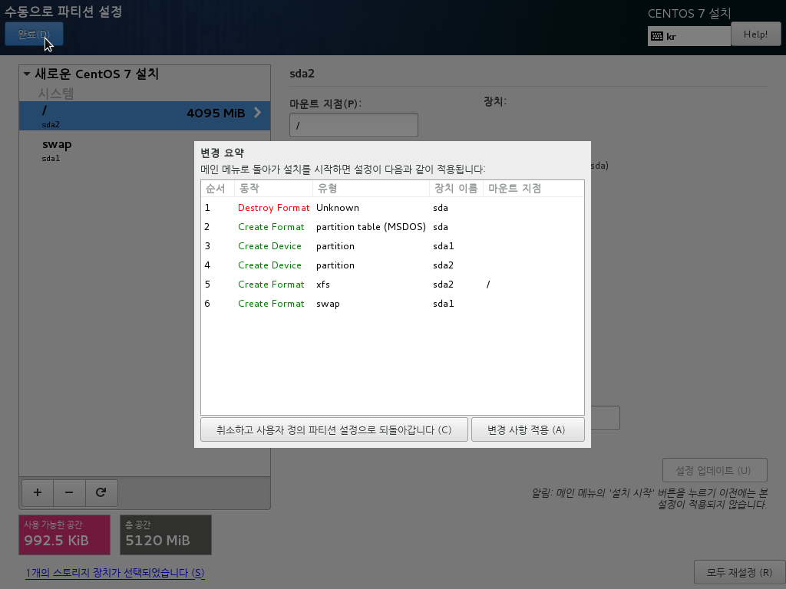
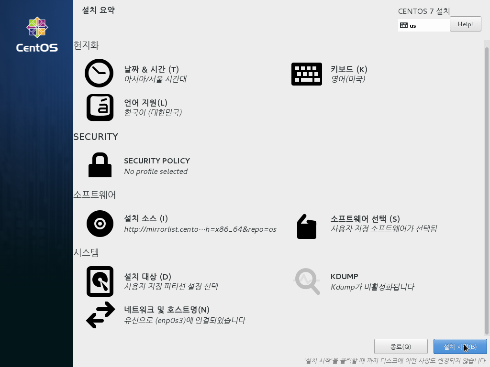

파티셔닝이 완료가 좌측 하단의 푸른색 "**_설치 시작(B)_**" 버튼을 클릭하여 설치를 시작 합니다.

<strong style="color: red;">주의</strong>: disk가 여러개일 경우에는 booting partion 설정에 주의하십시오.

## 4. 설치

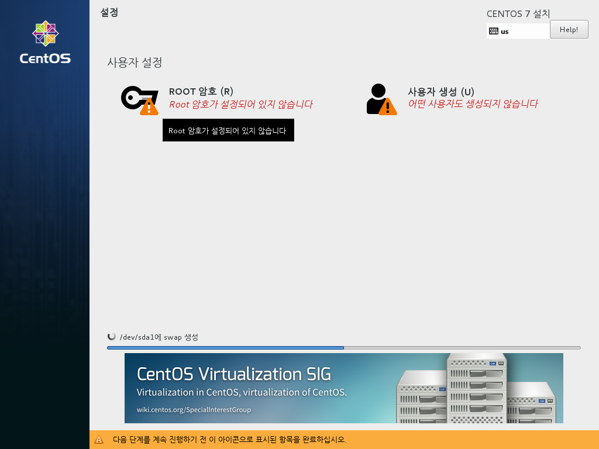

RHEL 7부터는 installer에도 systemd가 도입이 되었기 때문에 설치를 하는 중에 root 암호 설정과 계정 유저 생성을 동시에 진행을 하게 되므로, Root 암호 설정과 계정 사용자를 추가해 주십시오.

위의 화면과 같이 "**ROOT 암호 (R)**"과 "**사용자 생성 (U)**" 설정을 해 주어야 합니다.

주의할 것은, 안녕 리눅스 전환 후에 원격으로 ROOT shell login이 기본으로 차단이 되게 됩니다. 그러므로 일반 유저를 꼭 등록을 하여야 하며, 아래 이미지와 같이 root 계정으로 sudo 나 su를 할 수 있는 환경을 만들어 주십시오.

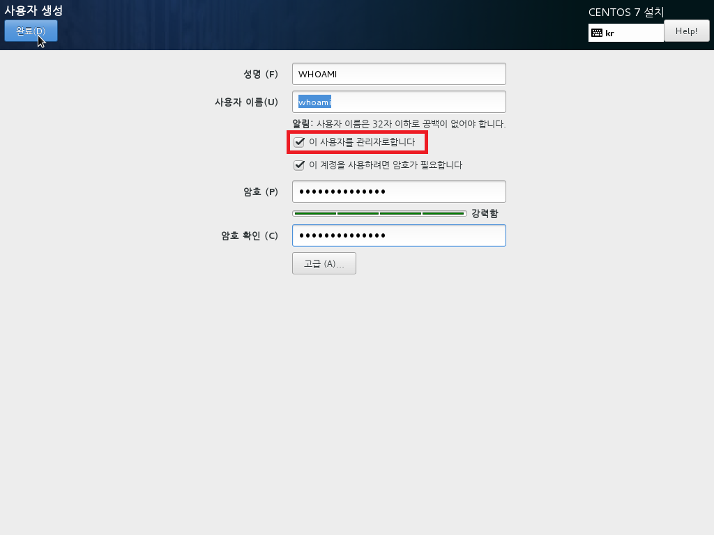

<strong style="color:red;">참고!!</strong> 주의할 것은, 생성한 일반 유저는 최초 접속시에 무조건 암호를 변경 되도록 되어 있습니다. 이는 ISMS 보안 심사를 위한 설정에 의하여 적용된 사항이므로, 다른 배포본과의 차이 입니다.

## 5. 설치 완료 및 재부팅

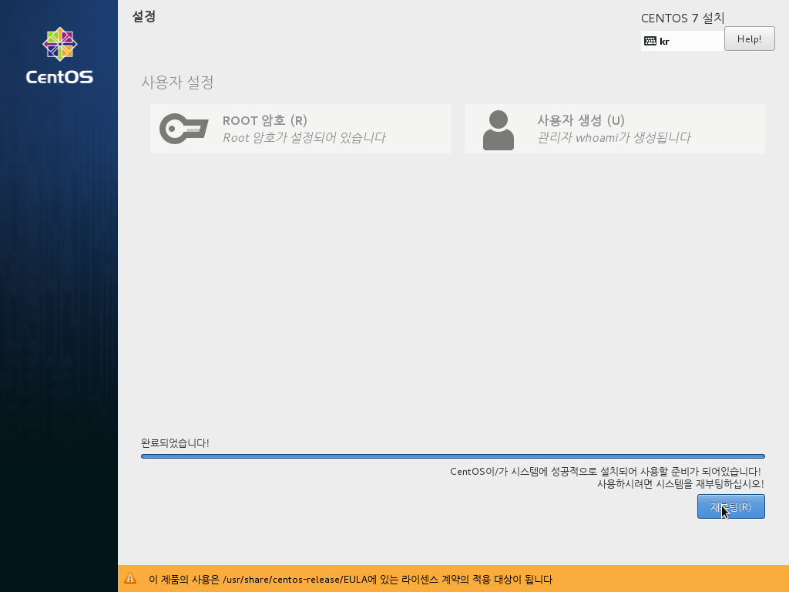

좌측 하단의 <strong style="color: red;">재부팅(R)</strong> 버튼이 푸른색으로 활성화가 되면, 클릭하여 리부팅을 합니다. AnNyung.ks 를 이용하여 설치하는 경우, 설치가 완료가 되면 자동으로 재시작 하도록 되어 있어 이 화면은 띄지 않을 수도 있습니다.

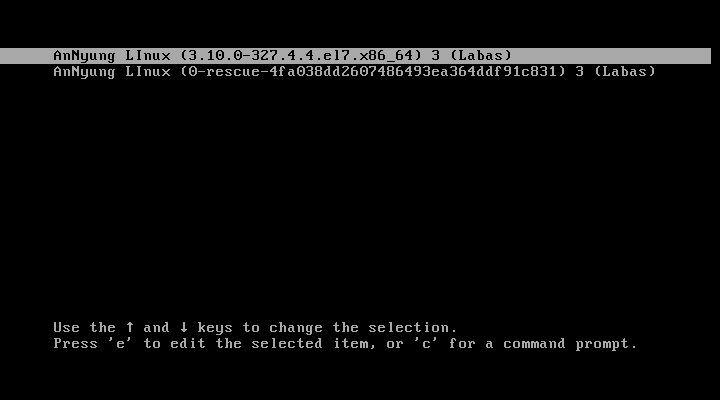
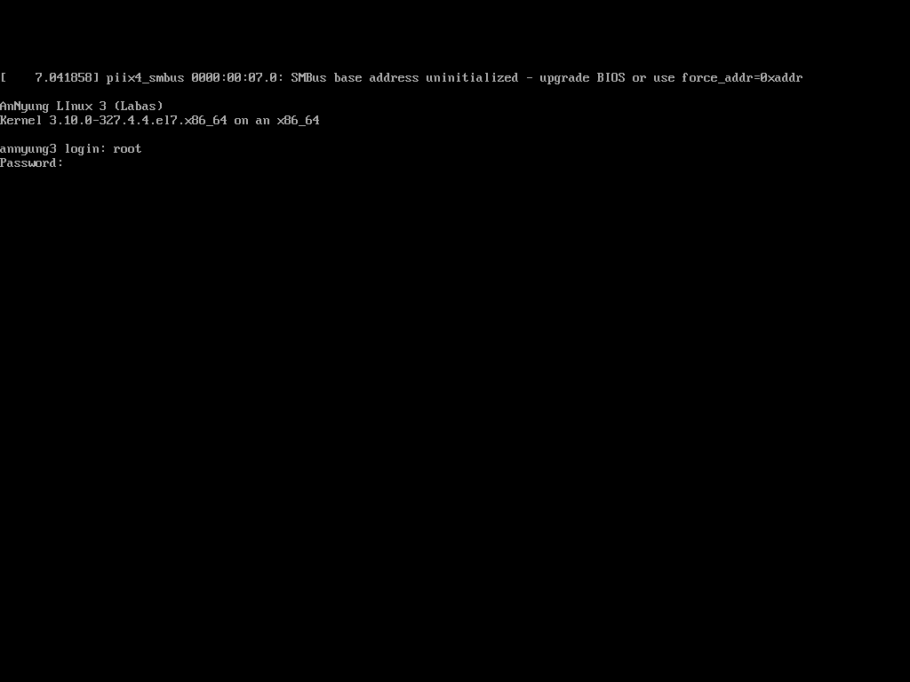

부팅을 하면 위의 화면과 같이 AnNyung LInux를 만날 수 있습니다. 다만 RHEL installer로 진행을 했을 경우에는 배너가 변경이 되지 않으니 참고 하시기 바랍니다.

설치시 지정한 암호를 이용하여 root로 로그인을 합니다.

## 6. 설치 후 확인

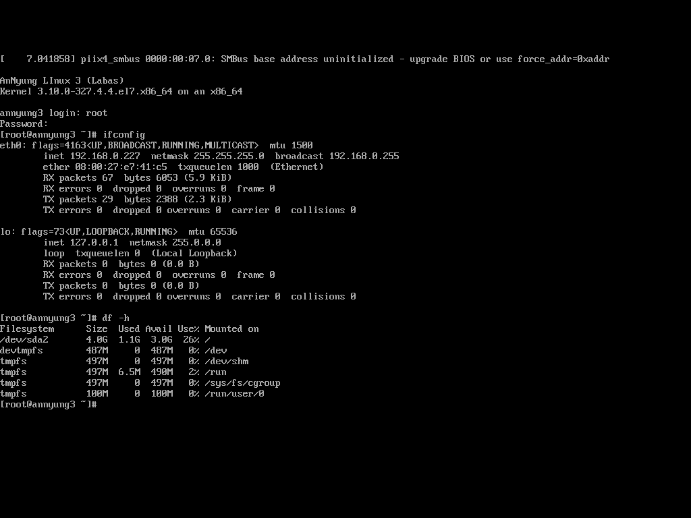

ethernet 이름이 다시 **eth**로 변경이 되었으며, 최초 설치 사이즈는 1.1Gbyte 입니다.

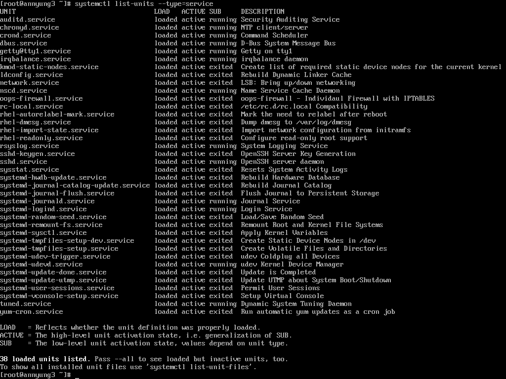

부팅시에 실행되는 daemon list 입니다. RHEL 6까지는 **ntsysv** 명령이나 **chkconfig** 명령으로 확인이 가능했지만, RHEL 7부터 systemd 도입으로 다음의 명령을 이용하면 가능 합니다.

```bahs
[root@localhost /root] systemctl list-units --type=service
[root@localhost /root] systemctl disable postfix  // postfix를 부팅시에 실행 안하도록
[root@localhost /root] systemctl enable postfix   // postfix를 부팅시에 실행 하도록
```

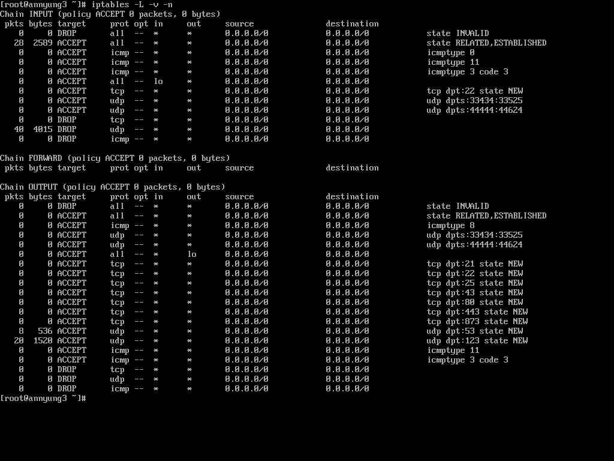

firewalld 대신에 설치된 oops-firewall 이 실행된 환경이며, 기본으로 inbound는 22번 port만 open이 되어 있습니다. 그리고, 안녕 3에 설치된 oops-firewall 7.x는 outbound ACL 제어가 더욱 확실해 졌기 때문에 outbound 설정도 잘 고려해야 합니다. outbound는 기본으로 tcp 21(ftp), 22(ssh), 25(smtp), 43(ntp), 80(http), 443(https), 873(rsync) 그리고 udp 53(dnslookup), 123(snmp)이 열려 있습니다.

## 7. 안녕 리눅스 운영상 참고 사항

안녕 리눅스 3은 ISMS 인증 심사 관련 설정이 deploy 되어 있기 때문에 이 설정으로 인한 운영상의 문제가 발생할 수 있습니다. 그러니 다음의 문서를 꼭 참고하여 운영상의 이슈에 대하여 대비 하시기 바랍니다.

1. [안녕 리눅스 3 Account 기본 설정](https://joungkyun.gitbooks.io/annyung-3-user-guide/content/chapter2-2-pam-control.html)
2. [안녕 리눅스 3 Firewall 설정](https://joungkyun.gitbooks.io/annyung-3-user-guide/content/chapter2-2-firewall.html)