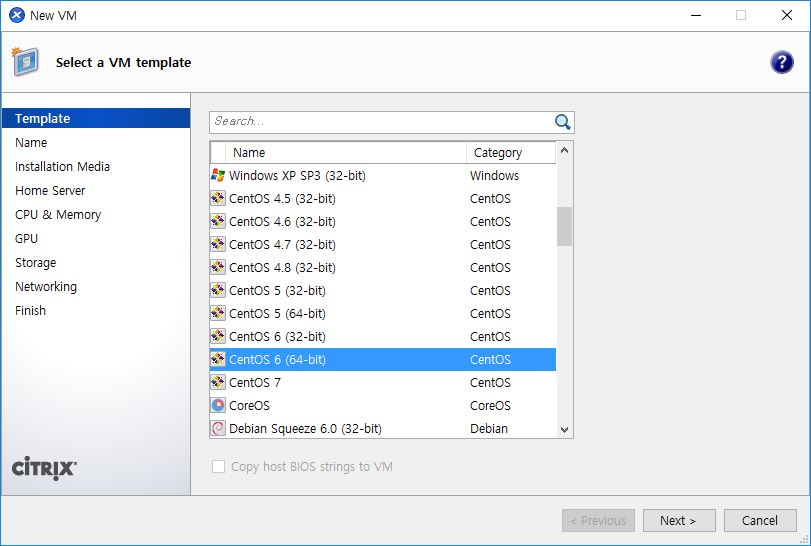
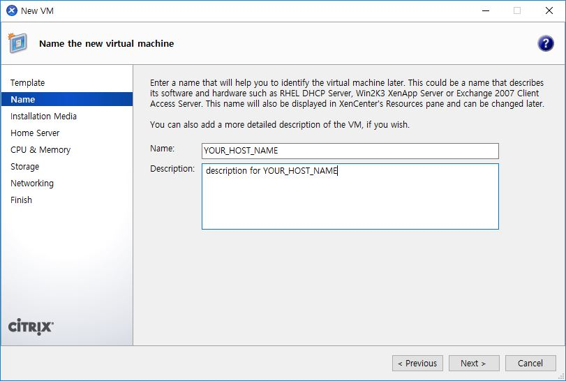
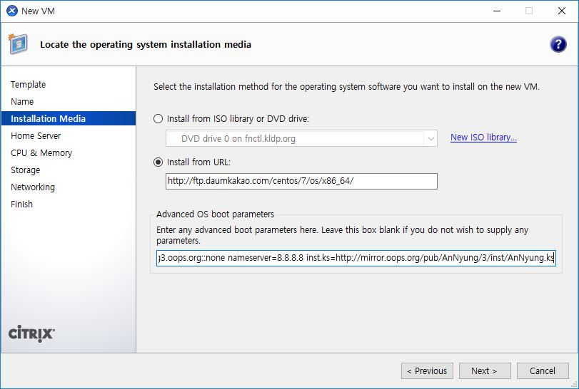

# Xen Server의 guest os로 설치

Not Yet!
**Copyright 2016 &copy; JoungKyun.Kim all rights reserved.**

2016.01.30 
김정균 &lt; http://oops.org &gt;

이 문서는 Xen Server에 안녕 리눅스 3을 설치하는 방법을 기술 합니다.

이 문서는 Windows용 Citrix XenCenter를 이용하여 설치하는 방법을 보여주며, Installer가 실행된 다음 부터는 <a href="chapter2.html">"**2. CentOS/RHEL 7 Network Insatll ISO를 이용한 설치**"</a> 와 동일하게 진행이 됩니다.

이 문서에서는 Xen Center를 이용하여 OS를 설치하는 과정을 모두 설명하지는 않습니다.

## 1. New VM 생성

geust OS를 생성하기 위하여 Xen Center를 실행하고, 상단 툴바에서 "**_New VM_**" 을 선택 합니다.

## 2. Select a VM template

여기서는 Xen server가 remote에 있다는 가정하에 진행을 합니다.

CentOS 7 template을 선택할 경우, Xen server의 local cdrom 또는 Bootp만 부팅에 사용을 할 수 있기 때문에 많은 귀찮음이 있습니다. 그래서 여기서는 CentOS 6 template을 사용하여 설치를 진행합니다.

그러므로, template은 **_CentOS 6 (64-bit)_** 을 선택하도록 합니다.

## 3. Name 설정

Xen Center의 트리에 보여지는 이름을 설정 합니다. 보통은 서버의 hostname을 지정해 주시면 됩니다. 역시 여기의 설정은 OS 설치에는 영향을 주지 않으며, 단순히 Xen Center에서 현재 만드는 VM을 인식하기 위한 정보로만 사용이 됩니다.

## 4. Insatll Media 설정

installation method는 "**Insatll From URL:**"을 선택 하도록 하고 CentOS 7의 boot image가 있는 URL을 지정해 줍니다. 한국의 mirror는 다음 중에 하나를 사용하실 수 있습니다.

> 1. http://ftp.daum.net/centos/7/os/x86_64
2. http://centos.tt.co.kr/7/os/x86_64
3. http://centos.mirror.cdnetworks.com/7/os/x86_64

다음, 하단의 "**Advanced OS boot parameters**"에 다음의 옵션을 추가해 줍니다.

    ip=YOUR_SERVER_IP::GATEWAY_IP:SUBNET_MASK:HOSTNAME::none nameserver=8.8.8.8 inst.ks=http://mirror.oops.org/pub/AnNyung/3/inst/AnNyung.ks inst.vnc

안녕 리눅스 2에서 처럼 asknetwork은 더이상 지원하지 않기 때문에, boot parameters에서 이제는 IP설정을 직접 해 줘야 합니다.

command option으로 위와 같이 옵션을 추가해 주도록 합니다. ip는 여러분의 상황에 맞게 수정을 해야 합니다. 각 옵션에 대한 설명은 다음과 같습니다.

* **ip**
 * 설치하는 네트워크에 DHCP서버가 있을 경우 
   이 경우가 가장 best choise인 환경입니다. 그냥 "**_ip=dhcp_**" 로 지정하면 됩니다.

 * DHCP가 없어 수동으로 해야 하는 경우 
   "**_IPv4_ADDR::GATEWAY:SUBNET_MASK:HOSTNAME:INTERFACE:MTU_**의 형식으로 지정합니다.

   * **IPv4_ADDR** - 32bit로 된 IPv4 주소(예를 들면 10.1.1.2)를 사용합니다. <u>IP주소와 Gateway의 구분자는 "**::**" 임을 주의해야 합니다. 나머지 구분자는 "**:**" 입니다.</u>

   * **_GATEWAY_** - 해당 네트워크의 GATEWAY 주소를 지정합니다.

   * **_SUBNET_MASK_** - 해당 네트워크의 subnet mask를 지정합니다.

   * **_HOSTNAME_** - 설치할 서버의 hostname을 지정합니다.

   * **_INTERFACE_** - 설치할 서버의 network interface를 지정합니다. 대부분은 비워 놓아도 상관이 없습니다만, 간혹 여려개의 network insterface를 가진 서버에서 installer와 설치된 OS간의 ineterface 이름이 다른 경우에는 지정해 주는 것이 좋습니다. 이에 대해서는 [RHEL 7 설치 가이드](https://access.redhat.com/documentation/ko-KR/Red_Hat_Enterprise_Linux/7/html/Installation_Guide/)의 [부트옵션](https://access.redhat.com/documentation/ko-KR/Red_Hat_Enterprise_Linux/7/html/Installation_Guide/chap-anaconda-boot-options.html) 섹션을 참고 하십시오.
   * **_MTU_** - 대부분은 none으로 지정하시면 됩니다. 기본값은 1500 입니다.

 * IPv6 네트워크인 경우 
   안녕 리눅스는 IPv6 테스트 환경이 없어 이에 대한 지원을 하지 않습니다. 이는 안녕 리눅스가 IPv6를 사용하는데 문제가 있다는 의미가 아니며, IPv6에 대해서 특별히 수정한 것이 없기 때문에 RHEL 7 또는 CentOS 7의 지원항목을 이용하시면 된다는 의미입니다.

* **nameserver** 
  domain name resoving을 위한 네임 서버를 지정합니다. 딱히 이유가 없다면 google public dns인 8.8.8.8을 지정하면 됩니다.

* **inst.ks** 
  안녕 리눅스의 설치 정보가 들어 있는 kickstart file을 지정합니다. 만약 mirror.oops.org가 장애가 있을 경우에는 http://ftp.kr.freebsd.org/pub/AnNyung/3/inst/AnNyung.ks 를 이용할 수 있습니다.

* **inst.vnc** 
  CentOS/RHEL 7의 installer의 경우 text mode 설치가 굉장히 번거롭기 때문에 graphical mode로 설치를 하는 것이 편합니다. 하지만, Xen Center의 console로는 graphical 설치가 불가능 하기 때문에 VNC를 이용하여 GUI 설치를 시도하는 방법을 제시 합니다. 아무런 옵션 없이 "**inst.vnc**"만 추가를 해 주면 됩니다. 

부팅 옵션에 대한 자세한 설명은 [RHEL 7 설치 가이드](https://access.redhat.com/documentation/ko-KR/Red_Hat_Enterprise_Linux/7/html/Installation_Guide/)의 [부트옵션](https://access.redhat.com/documentation/ko-KR/Red_Hat_Enterprise_Linux/7/html/Installation_Guide/chap-anaconda-boot-options.html) 섹션을 참고 하십시오.

## 3. VNC 연결

 