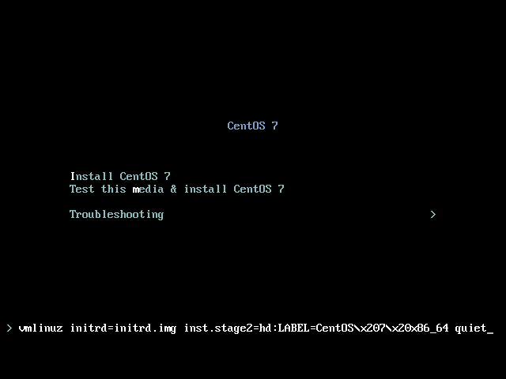

# Xen Server의 guest os로 설치

**Copyright 2017 &copy; JoungKyun.Kim all rights reserved.**

2017.07.26<br>
김정균 &lt; http://oops.org &gt;

이 문서는 Xen Server에 안녕 리눅스 3을 설치하는 방법을 기술 합니다.

이 문서는 Windows용 Citrix XenCenter를 이용하여 설치하는 방법을 보여주며, Installer가 실행된 다음 부터는 <a href="chapter2.html">"**2. CentOS/RHEL 7 Network Insatll ISO를 이용한 설치**"</a> 와 동일하게 진행이 됩니다.

이 문서에서는 Xen Center를 이용하여 OS를 설치하는 과정을 모두 설명하지는 않습니다.

또는, Xen Center를 이용하여 CentOS 7을 설치가 가능하신 분은 Installer에서 Core package만 설치 하신 후에, <a href="chapter1.html">"**1. CentOS/RHEL 7 Miniamll ISO를 이용한 설치**"</a> 문서의 "**9. 안녕 리눅스 전환**" 항목을 참고 하여 진행할 수 있습니다.

## 1. 설치 Media 환경 준비

CentOS 7 template에서는 더이상 "***install from URL***" 방법이 지원되지 않고, ***CD-ROM 설치*** 또는 ***PXE 설치*** 만 지원이 됩니다.

***PXE*** 설치 환경이 가능하시면 ***PXE 설치*** 를 이용하시면 됩니다.

***PXE 설치*** 환경이 없고 서버의 CD-ROM에 접근이 불가능 하다면, 다음의 작업을 이용하여 가상 CD-ROM 설치가 가능 합니다.

다음 작업은 XenServer Host 에서 실행 합니다. (Guest VM에서 하지 않습니다.)

```bash
[root@vmhost ~]$ mkdir -p /home/isos
[root@vmhost ~]$ cd /home/isos
[root@vmhost isos]$ wget http://ftp.daumkakao.com/centos/7/isos/x86_64/CentOS-7-x86_64-NetInstall-1611.iso
[root@vmhost isos]$ xe sr-create name-label=isos \
                       type=iso device-config:location=/home/isos \
                       device-config-legacy_mode=true content-type=iso
```

명령을 실행하고 나면 다음과 같이 XenCenter에서 ***isos*** 가 CD-ROM type으로 등록이 됩니다.


## 1. New VM 생성

geust OS를 생성하기 위하여 Xen Center를 실행하고, 상단 툴바에서 "**_New VM_**" 을 선택 합니다.


## 2. Select a VM template


여기서는 Xen server가 remote에 있다는 가정하에 진행을 합니다.

CentOS 7 template을 선택할 경우, Xen server의 local cdrom 또는 Bootp만 부팅에 사용을 할 수 있기 때문에 많은 귀찮음이 있습니다. 그래서 여기서는 CentOS 6 template을 사용하여 설치를 진행합니다.

그러므로, template은 **_CentOS 6 (64-bit)_** 을 선택하도록 합니다.

PXE 설치가 가능한 경우에는 **_CentOS 7_** template으로 설치가 가능하며, 이 경우 기능이 향상된 **_XenCenter_** console을 사용할 수 있습니다.


## 3. Name 설정


Xen Center의 트리에 보여지는 이름을 설정 합니다. 보통은 서버의 hostname을 지정해 주시면 됩니다. 역시 여기의 설정은 OS 설치에는 영향을 주지 않으며, 단순히 Xen Center에서 현재 만드는 VM을 인식하기 위한 정보로만 사용이 됩니다.


## 4. Insatll Media 설정


***PXE 설치 환경*** 이 있다면, ***Boot from network***을 선택 합니다. 여기서는 ***가상 CD-ROM*** 을 이용한 환경으로 설명을 합니다.

CD-ROM 이 있다면 CD-ROM을 선택 하시고, 가상 CD-ROM 작업을 하였다면, isos 아래의 ISO 파일을 선택 하도록 합니다.


## 5. CPU & Memory


***vCPU***는 원하시는 만큼 설정을 하십시오. 최대값은 ***실제 core 수*** 보다 많지 않게 합니다. 참고로 ***XenServer*** 의 경우 CPU core를 hard하게 분배하지 않기 때문에, full 로 잡는 것을 개인적으로 권장 합니다.

메모리의 경우, CentOS 7.1 부터는 install image의 크기가 커져서 설치 시에 Memory가 최소한 ***2G*** 가 필요 합니다. 그러므로, 2G 이하로 잡고 싶다면 설치를 마친 후에 Guest 설정에서 메모리를 줄여 주시면 됩니다.


## 6. 설치 시작


VM을 시작하여 Installer 가 구동이 되면 제일 처음은 위와 같은 화면이 나오게 됩니다.

화살표 키를 이용하여 이미지 상의 붉은 색 상자로 표시되어 있는 "**Install CentOS 7**" 을 선택을 선택한 후에, "**Tab**" 키를 누릅니다. 그러면 아래의 이미지와 같이 하단에 booting option을 입력할 수 있게 됩니다. 만약 UEFI 기반의 시스템일 경우에는 "**e**"키를 눌러서 booting option을 입력할 수 있습니다.

이 부분이 잘 이해가 되지 않는다면 [RHEL 7 설치 가이드](https://access.redhat.com/documentation/ko-KR/Red_Hat_Enterprise_Linux/7/html/Installation_Guide/)의 [부트메뉴](https://access.redhat.com/documentation/ko-KR/Red_Hat_Enterprise_Linux/7/html/Installation_Guide/sect-boot-menu-x86.html) 섹션을 참고 하십시오.



여기에 아래와 같이 안녕 리눅스 설치를 위한 옵션을 추가해 줍니다.


RHEL 7에서 systemd를 도입하면서, installer인 Anaconda에도 systemd가 도입이 되면서 네트워크 인스톨 시에 IP를 입력하던 UI가 사라지고 이처럼 command line에서 IP를 지정을 해 줘야 하는 불편함이 생겼습니다. 여기서 IP를 지정하지 않아도 installer상에서 설정이 가능하지만, 그렇데 된다면 kickstart를 network으로 받아오지 못하는 관계로 command line option으로 IP를 지정해 줘야 합니다.

```
inst.vnc ip=192.168.0.227::192.168.0.1:255.255.255.0:annyung3.oops.org::none nameserver=8.8.8.8 inst.ks=http://mirror.oops.org/pub/AnNyung/3/inst/AnNyung.ks
```

command option으로 위와 같이 옵션을 추가해 주도록 합니다. ip는 여러분의 상황에 맞게 수정을 해야 합니다. 각 옵션에 대한 설명은 다음과 같습니다.

***참고로, CentOS 7은 text mode 설치가 매우 불편하므로, graphic mode로 설치를 하는 것이 좋은데, XenCenter의 console은 이를 지원하지 못합니다. 그러므로 옵션에 inst.vnc 를 추가하여 VNC를 이용하여 설치를 해야 합니다. (하단 참조)***

* **utf8**<br>
  따로 지정하지 않아도 상관이 없습니다. deprecated 똔느 remove 된 옵션으로 이미지상에 나와 있어 설명을 추가 합니다. 그냥 지정하지 않으면 됩니다.

* **noipv6**<br>
  설치 프로그램에서 IPv6 지원을 비활성화하는데 사용됩니다. IPv6는 커널에 탑재되어 드라이버는 블랙리스트에 실리지 않습니다. 하지만 ipv6.disable dracut 옵션을 사용하여 IPv6를 비활성화할 수 있습니다.
  안녕리눅스 설치시에는 installer post script에서 기본으로 ipv6를 off 시키고 있으니, 여기서의 지정 유무는 영향을 주지 않습니다. 역시 지정하지 않아도 무방합니다.

* **ip**
 * 설치하는 네트워크에 DHCP서버가 있을 경우<br>
   이 경우가 가장 best choise인 환경입니다. 그냥 "**_ip=dhcp_**" 로 지정하면 됩니다.

 * DHCP가 없어 수동으로 해야 하는 경우<br>
   "**_IPv4_ADDR::GATEWAY:SUBNET_MASK:HOSTNAME:INTERFACE:MTU_**의 형식으로 지정합니다.

   * **IPv4_ADDR** - 32bit로 된 IPv4 주소(예를 들면 10.1.1.2)를 사용합니다. <u>IP주소와 Gateway의 구분자는 "**::**" 임을 주의해야 합니다. 나머지 구분자는 "**:**" 입니다.</u>

   * **_GATEWAY_** - 해당 네트워크의 GATEWAY 주소를 지정합니다.

   * **_SUBNET_MASK_** - 해당 네트워크의 subnet mask를 지정합니다.

   * **_HOSTNAME_** - 설치할 서버의 hostname을 지정합니다.

   * **_INTERFACE_** - 설치할 서버의 network interface를 지정합니다. 대부분은 비워 놓아도 상관이 없습니다만, 간혹 여려개의 network insterface를 가진 서버에서 installer와 설치된 OS간의 ineterface 이름이 다른 경우에는 지정해 주는 것이 좋습니다. 이에 대해서는 [RHEL 7 설치 가이드](https://access.redhat.com/documentation/ko-KR/Red_Hat_Enterprise_Linux/7/html/Installation_Guide/)의 [부트옵션](https://access.redhat.com/documentation/ko-KR/Red_Hat_Enterprise_Linux/7/html/Installation_Guide/chap-anaconda-boot-options.html) 섹션을 참고 하십시오.
   * **_MTU_** - 대부분은 none으로 지정하시면 됩니다. 기본값은 1500 입니다.

 * IPv6 네트워크인 경우<br>
   안녕 리눅스는 IPv6 테스트 환경이 없어 이에 대한 지원을 하지 않습니다. 이는 안녕 리눅스가 IPv6를 사용하는데 문제가 있다는 의미가 아니며, IPv6에 대해서 특별히 수정한 것이 없기 때문에 RHEL 7 또는 CentOS 7의 지원항목을 이용하시면 된다는 의미입니다.

* **nameserver**<br>
  domain name resoving을 위한 네임 서버를 지정합니다. 딱히 이유가 없다면 google public dns인 8.8.8.8을 지정하면 됩니다.

* **inst.ks**<br>
  안녕 리눅스의 설치 정보가 들어 있는 kickstart file을 지정합니다. 만약 mirror.oops.org가 장애가 있을 경우에는 http://ftp.kr.freebsd.org/pub/AnNyung/3/inst/AnNyung.ks 를 이용할 수 있습니다.

* **inst.vnc**<br>
  CentOS/RHEL 7의 installer의 경우 text mode 설치가 굉장히 번거롭기 때문에 graphical mode로 설치를 하는 것이 편합니다. 하지만, Xen Center의 console로는 graphical 설치가 불가능 하기 때문에 VNC를 이용하여 GUI 설치를 시도하는 방법을 제시 합니다. 아무런 옵션 없이 "**inst.vnc**"만 추가를 해 주면 됩니다. 만약, kickstart 에서 disk partition과 root 암호, account 생성까지 처리를 하신다면, kickstart를 text mode로 지정하여 VNC 없이 진행하는 것도 가능 합니다. 이 방법은 DIY 하시기 바랍니다.


부팅 옵션에 대한 자세한 설명은 [RHEL 7 설치 가이드](https://access.redhat.com/documentation/ko-KR/Red_Hat_Enterprise_Linux/7/html/Installation_Guide/)의 [부트옵션](https://access.redhat.com/documentation/ko-KR/Red_Hat_Enterprise_Linux/7/html/Installation_Guide/chap-anaconda-boot-options.html) 섹션을 참고 하십시오.
 
부팅 옵션을 입력한 후, 엔터를 누르면 설치 화면으로 넘어가게 됩니다.


## 6. VNC 연결 및 설치

VNC를 이용한 설치 방법에 대한 자세한 설명은 [RHEL 7 설치 가이드](https://access.redhat.com/documentation/ko-KR/Red_Hat_Enterprise_Linux/7/html/Installation_Guide/)의 [22장. VNC를 사용하여 설치하기](https://access.redhat.com/documentation/ko-KR/Red_Hat_Enterprise_Linux/7/html/Installation_Guide/chap-vnc-installations.html) 섹션을 참고 하십시오.
 
이 문서에서는 [RHEL 7 설치 가이드](https://access.redhat.com/documentation/ko-KR/Red_Hat_Enterprise_Linux/7/html/Installation_Guide/)의 [22장. VNC를 사용하여 설치하기](https://access.redhat.com/documentation/ko-KR/Red_Hat_Enterprise_Linux/7/html/Installation_Guide/chap-vnc-installations.html) 섹션에서 예를 든, VNC viewer를 TigerVNC가 아닌 [TightVNC](http://www.tightvnc.com/)를 이용하여 진행을 합니다.

> 다운로드: http://www.tightvnc.com/download.php

***Install option*** 을 설정한 후에 설치를 시작합니다.


Xen Center의 guset os console에서 보면 위의 이미지와 같이 VNC 서버가 뜨게 됩니다.


다음, 설치한 TightVNC viewer를 실행하고, Xen Center console에 뜬 VNC 접속 주소를 Remote Host에 입력해 줍니다. 현재 예제에서는 Xen Center console에는 "**open-new.#######:1**" 이라고 되어 있고, VNC viewer의 Remote Host에는 "**192.168.0.227:1**" 이라고 다르게 되어 있는데, 이는 예제 파일을 만들다 보니 다르게 되어 있을 뿐, 실제로는 Xen Center Console에 뜬 "**주소:1**" 즉 domain.com:1 또는 1.1.1.1:1 처럼 넣어 주시면 됩니다.


VNC 접속이 이루어지고, GUI installer가 VNC viewer에 뜬 모습니다.

## 7. 설치 시작

여기서 부터는 Miniall ISO또는 Network Install ISO를 이용한 방법과 동일하게 진행이 됩니다.


disk partitioning을 완료하고 우측 하단의 푸른색 "**설치 시작(D)**" 버튼을 클릭하여 설치를 시작합니다.


설치가 되는 동안, ROOT 암호와 user account를 생성 합니다.


ROOT 암호 변경 페이지 입니다.


일반 사용자 계정 추가 페이지 입니다.

<strong style="color:red;">참고!!</strong>  
주의할 것은, 생성한 일반 유저는 최초 접속시에 무조건 암호를 변경 되도록 되어 있습니다. 이는 ISMS 보안 심사를 위한 설정에 의하여 적용된 사항이므로, 다른 배포본과의 차이 입니다.


AnNyung.ks 를 이용하여 설치를 하면, 설치 완료 후 자동 부팅이 되므로, 위의 이미지와 같이 설치 완료시에 VNC 접속이 끊어지게 되오니, 당황할 필요 없이 VNC viewer를 종료 시키면 됩니다.


VNC 연결 종료 후, Xen Center의 console로 돌아가 보면 위의 이미지처럼 로그인 화면이 띄게 됩니다. 설치시에 지정하였던 ROOT 암호를 이용하여 로그인을 하면 됩니다.


## 8. 안녕 리눅스 운영상 참고 사항

안녕 리눅스 3은 ISMS 인증 심사 관련 설정이 deploy 되어 있기 때문에 이 설정으로 인한 운영상의 문제가 발생할 수 있습니다. 그러니 다음의 문서를 꼭 참고하여 운영상의 이슈에 대하여 대비 하시기 바랍니다.

1. [안녕 리눅스 3 Account 기본 설정](https://joungkyun.gitbooks.io/annyung-3-user-guide/content/chapter2-2-pam-control.html)
2. [안녕 리눅스 3 Firewall 설정](https://joungkyun.gitbooks.io/annyung-3-user-guide/content/chapter2-1-firewall.html)